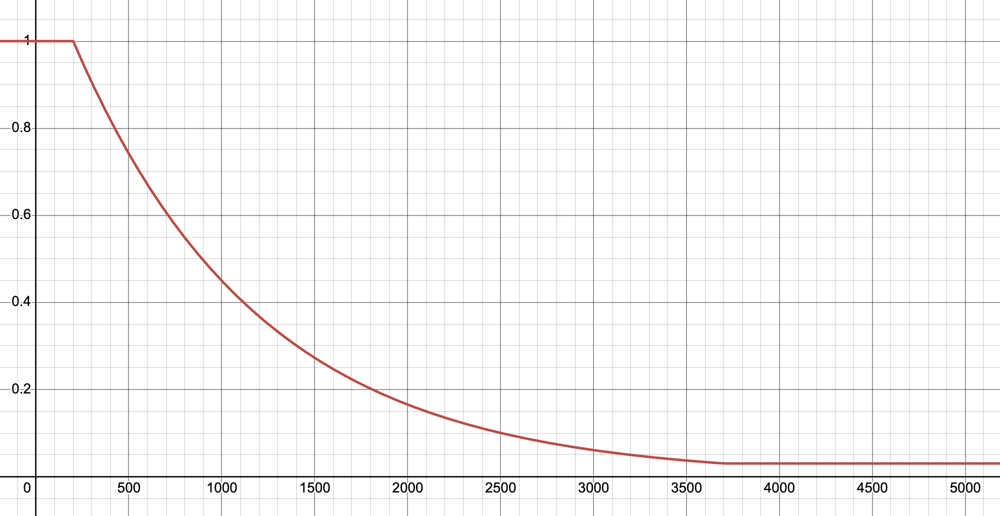

# PSGD Kron

For original PSGD repo, see [psgd_torch](https://github.com/lixilinx/psgd_torch).

For JAX version, see [psgd_jax](https://github.com/evanatyourservice/psgd_jax).

Implementation of [PSGD Kron optimizer](https://github.com/lixilinx/psgd_torch) in PyTorch. 
PSGD is a second-order optimizer originally created by Xi-Lin Li that uses either a hessian-based 
or whitening-based (gg^T) preconditioner and lie groups to improve training convergence, 
generalization, and efficiency. I highly suggest taking a look at Xi-Lin's PSGD repo's readme linked
to above for interesting details on how PSGD works and experiments using PSGD.

### `kron`:

The most versatile and easy-to-use PSGD optimizer is `kron`, which uses a Kronecker-factored 
preconditioner. It has less hyperparameters that need tuning than adam, and can generally act as a 
drop-in replacement for adam.

## Installation

```bash
pip install kron-torch
```

## Basic Usage (Kron)

Kron schedules the preconditioner update probability by default to start at 1.0 and anneal to 0.03 
at the beginning of training, so training will be slightly slower at the start but will speed up 
to near adam's speed by around 3k steps.

For basic usage, use `kron` optimizer like any other pytorch optimizer:

```python
from kron_torch import Kron

optimizer = Kron(params)

optimizer.zero_grad()
loss.backward()
optimizer.step()
```

**Basic hyperparameters:**

TLDR: Learning rate and weight decay act similarly to adam's, start with adam-like settings and go 
from there. There is no b2 or epsilon.

These next settings control whether a dimension's preconditioner is diagonal or triangular. 
For example, for a layer with shape (256, 128), triagular preconditioners would be shapes (256, 256)
and (128, 128), and diagonal preconditioners would be shapes (256,) and (128,). Depending on how 
these settings are chosen, `kron` can balance between memory/speed and effectiveness (see below).

`max_size_triangular`: Anything above this value will have a diagonal preconditioner, anything 
below will have a triangular preconditioner. So if you have a dim with size 16,384 that you want 
to use a diagonal preconditioner for, set `max_size_triangular` to something like 15,000. Default 
is 8192.

`max_skew_triangular`: Any tensor with skew above this value with make the larger dim diagonal.
For example, if `max_skew_triangular` = 10, a bias layer of shape (256,) would be diagonal 
because 256/1 > 10, and an embedding layer with shape (50000, 768) would be (diag, tri) 
because 50000/768 is greater than 10. The default value is 'inf'.

`min_ndim_triangular`: Any tensor with less than this number of dims will have all diagonal 
preconditioners. Default is 2, so single-dim tensors like bias and scale will use diagonal
preconditioners.

Interesting setups using these settings:

- Setting `max_size_triangular` to 0 will make all layers have diagonal preconditioners, which uses 
very little memory and runs the fastest, but the optimizer might be less effective.

- With `max_skew_triangular` set to 1, if a layer has one dim larger than the rest, it will use a diagonal 
preconditioner. This setup usually results in less memory usage than adam, and is more performant 
than having all diagonal preconditioners.

`preconditioner_update_probability`: Preconditioner update probability uses a schedule by default 
that works well for most cases. It anneals from 1 to 0.03 at the beginning of training, so training 
will be slightly slower at the start but will speed up to near adam's speed by around 3k steps. PSGD 
generally benefits from more preconditioner updates at the start of training, but once the preconditioner
is learned it's okay to do them less often.

This is the default schedule in the `precond_update_prob_schedule` function at the top of kron.py:




See kron.py for more hyperparameter details.


## Resources

PSGD papers and resources listed from Xi-Lin's repo

1) Xi-Lin Li. Preconditioned stochastic gradient descent, [arXiv:1512.04202](https://arxiv.org/abs/1512.04202), 2015. (General ideas of PSGD, preconditioner fitting losses and Kronecker product preconditioners.)
2) Xi-Lin Li. Preconditioner on matrix Lie group for SGD, [arXiv:1809.10232](https://arxiv.org/abs/1809.10232), 2018. (Focus on preconditioners with the affine Lie group.)
3) Xi-Lin Li. Black box Lie group preconditioners for SGD, [arXiv:2211.04422](https://arxiv.org/abs/2211.04422), 2022. (Mainly about the LRA preconditioner. See [these supplementary materials](https://drive.google.com/file/d/1CTNx1q67_py87jn-0OI-vSLcsM1K7VsM/view) for detailed math derivations.)
4) Xi-Lin Li. Stochastic Hessian fittings on Lie groups, [arXiv:2402.11858](https://arxiv.org/abs/2402.11858), 2024. (Some theoretical works on the efficiency of PSGD. The Hessian fitting problem is shown to be strongly convex on set ${\rm GL}(n, \mathbb{R})/R_{\rm polar}$.)
5) Omead Pooladzandi, Xi-Lin Li. Curvature-informed SGD via general purpose Lie-group preconditioners, [arXiv:2402.04553](https://arxiv.org/abs/2402.04553), 2024. (Plenty of benchmark results and analyses for PSGD vs. other optimizers.)


## License

[![CC BY 4.0][cc-by-image]][cc-by]

This work is licensed under a [Creative Commons Attribution 4.0 International License][cc-by].

2024 Evan Walters, Omead Pooladzandi, Xi-Lin Li


[cc-by]: http://creativecommons.org/licenses/by/4.0/
[cc-by-image]: https://licensebuttons.net/l/by/4.0/88x31.png
[cc-by-shield]: https://img.shields.io/badge/License-CC%20BY%204.0-lightgrey.svg
